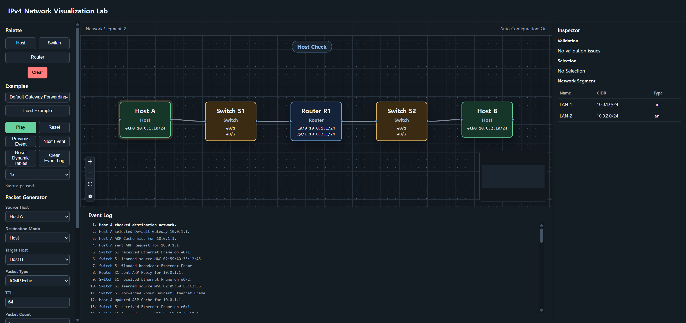

# IPv4 Network Visualization Lab



IPv4 Network Visualization Lab은 브라우저에서 네트워크 토폴로지를 만들고, 패킷이 이동하는 과정을 눈으로 따라가며 학습할 수 있는 교육용 시뮬레이터입니다.

`Host`, `Switch`, `Router`, `Link`를 캔버스에 배치하면 앱이 `Network Segment`, IP 주소, `Default Gateway`, 라우팅 정보를 자동으로 구성합니다. 사용자는 복잡한 설정을 먼저 외우기보다, 네트워크가 실제로 어떤 순서로 동작하는지 화면에서 확인할 수 있습니다.

## 주요 기능

- 캔버스에서 `Host`, `Switch`, `Router`, `Link`로 토폴로지 구성
- `Network Segment`, IP 주소, `Default Gateway` 자동 설정
- `ICMP Echo Request`와 `ICMP Echo Reply` 흐름 시뮬레이션
- `Generic IPv4 Packet` 전송과 RAW payload 확인
- ARP 요청/응답, `ARP Cache`, 스위치 `MAC Address Table` 변화 추적
- `Routing Table`, `Longest Prefix Match`, `TTL` 감소 과정 확인
- 패킷 이동 애니메이션과 `Event Log`로 처리 단계 확인
- URL 공유, JSON 내보내기/가져오기, 로컬 저장 지원

## 이런 실험을 할 수 있습니다

가장 기본적인 예시는 `Host A - Switch S1 - Router R1 - Switch S2 - Host B` 형태의 토폴로지입니다. `Host A`에서 `Host B`로 패킷을 보내면, `Host A`가 `Default Gateway`를 선택하고 ARP를 수행한 뒤, `Router R1`이 패킷을 받아 라우팅하고 다시 캡슐화하는 과정을 순서대로 볼 수 있습니다.

동일 LAN 통신, 라우터 간 전달, MTU Fragmentation, 중복 라우터 경로, 라우팅 실패 같은 예제도 제공되어 네트워크 동작을 비교해 볼 수 있습니다.

## 실행하기

```bash
npm install
npm run dev
```

브라우저에서 출력된 로컬 주소를 열면 바로 사용할 수 있습니다.

Docker로 실행하려면 다음 명령을 사용할 수 있습니다.

```bash
docker build -t network-lab .
docker run --rm -p 8080:80 network-lab
```

그다음 `http://localhost:8080`을 열면 됩니다.
